# Business Context from Multiple View Schemas

## Mermaid Diagram

```mermaid
flowchart TD
    Start([New Sheet Inserted]) --> CreateView[createDbViewFromSheet]
    
    CreateView --> RegisterView[Register View: Get unique viewName]
    
    RegisterView --> ExtractSchema[Extract Schema: getSchema tool]
    
    ExtractSchema --> CheckExisting{Business Context Exists?}
    
    CheckExisting -->|No| InitializeContext[Initialize Business Context]
    CheckExisting -->|Yes| LoadContext[Load Existing Business Context]
    
    InitializeContext --> AnalyzeSchema[Analyze Schema Structure]
    LoadContext --> AnalyzeSchema
    
    AnalyzeSchema --> ExtractEntities[Extract Business Entities from Schema]
    
    ExtractEntities --> AnalyzeColumns[Analyze Column Names and Types]
    
    AnalyzeColumns --> InferBusinessConcepts[Infer Business Concepts: Map column names to business entities]
    
    InferBusinessConcepts --> DetectRelationships[Detect Relationships: Find potential joins between views]
    
    DetectRelationships --> ExtractDataPatterns[Extract Data Patterns: Identify business rules from data types]
    
    ExtractDataPatterns --> BuildVocabulary[Build Business Vocabulary: Create mappings from technical to business terms]
    
    BuildVocabulary --> CheckMultipleViews{Multiple Views Available?}
    
    CheckMultipleViews -->|Yes| CrossViewAnalysis[Cross-View Analysis: Compare schemas across all views]
    CheckMultipleViews -->|No| UpdateContext[Update Business Context]
    
    CrossViewAnalysis --> FindCommonEntities[Find Common Entities: Identify shared columns and relationships]
    
    FindCommonEntities --> InferBusinessDomain[Infer Business Domain: Understand overall business model]
    
    InferBusinessDomain --> BuildEntityGraph[Build Entity Relationship Graph: Map all business entities and connections]
    
    BuildEntityGraph --> UpdateContext
    
    UpdateContext --> StoreContext[(Store Enhanced Business Context)]
    
    StoreContext --> ContextReady[Business Context Ready]
    
    ContextReady --> UseForQueries[Use Context for SQL Generation and User Communication]
    
    UseForQueries --> End([Improved Query Accuracy and User Experience])
    
    style ExtractSchema fill:#e1f5ff
    style AnalyzeSchema fill:#e1f5ff
    style ExtractEntities fill:#e1f5ff
    style AnalyzeColumns fill:#e1f5ff
    style InferBusinessConcepts fill:#e1f5ff
    style DetectRelationships fill:#e1f5ff
    style ExtractDataPatterns fill:#e1f5ff
    style BuildVocabulary fill:#fff4e1
    style CrossViewAnalysis fill:#fff4e1
    style FindCommonEntities fill:#fff4e1
    style InferBusinessDomain fill:#fff4e1
    style BuildEntityGraph fill:#fff4e1
    style UpdateContext fill:#e8f5e9
    style StoreContext fill:#f3e5f5
```



## Key Components

### 1. Schema Extraction from Multiple Views
- **Trigger**: When `createDbViewFromSheet` → `getSchema` is called
- **Process**:
  - Each new sheet insertion triggers schema extraction
  - Schema includes: column names, data types, view structure
  - Multiple views accumulate to build comprehensive business context

### 2. Business Entity Extraction
- **From Single View**:
  - Analyze column names → infer business entities (e.g., "user_id" → "User", "order_date" → "Order")
  - Analyze data types → infer business rules (e.g., VARCHAR → text data, BIGINT → numeric IDs)
  - Extract view structure → understand data organization

### 3. Cross-View Analysis (Multiple Views)
- **When Multiple Views Exist**:
  - Compare schemas across all views
  - Find common columns → identify relationships (e.g., "user_id" appears in multiple views)
  - Detect join opportunities → understand business connections
  - Build entity relationship graph → map entire business model

### 4. Business Vocabulary Building
- **Purpose**: Create mappings from technical terms to business concepts
- **Process**:
  - Column names → Business entities (e.g., "dept_id" → "Department")
  - View names → Business domains (e.g., "sheet_abc123" → "Employee Data")
  - Relationships → Business logic (e.g., "user_id" connects Users to Orders)

### 5. Business Context Accumulation
- **Storage**: Conversation state (persisted with conversationId)
- **Updates**: 
  - On each sheet insertion (schema analysis)
  - Context improves with each new view added
  - Cross-view analysis becomes more accurate with more views

### 6. Context Usage
- **For SQL Generation**:
  - Use business vocabulary to understand user queries
  - Apply business rules from schema analysis
  - Use correct view names and relationships
  - Generate accurate JOIN queries based on detected relationships

### 7. Semantic Layer
- **Components**:
  - Business vocabulary (technical → business term mappings)
  - Entity mappings (column → business concept)
  - Relationship graph (how views connect)
  - Business domain model (overall understanding)

## Implementation Points

1. **Business Context Structure**:
   ```typescript
   interface BusinessContext {
     entities: Map<string, BusinessEntity>; // column → business concept
     vocabulary: Map<string, string>; // technical term → business term
     relationships: Relationship[]; // detected relationships between views
     entityGraph: EntityGraph; // graph of all business entities and connections
     domain: BusinessDomain; // inferred from all schemas
     views: ViewMetadata[]; // metadata for each view
   }
   
   interface BusinessEntity {
     name: string; // business concept name
     columns: string[]; // columns that represent this entity
     views: string[]; // views containing this entity
     dataType: string; // inferred data type
   }
   
   interface Relationship {
     fromView: string;
     toView: string;
     joinColumn: string; // common column name
     type: 'one-to-one' | 'one-to-many' | 'many-to-many';
   }
   ```

2. **Schema Analysis Flow** (after `getSchema`):
   - **Single View**: Extract entities, infer concepts, build vocabulary
   - **Multiple Views**: Cross-analyze, find relationships, build entity graph
   - **Accumulation**: Each new view enhances the overall business context

3. **Cross-View Analysis**:
   - Compare column names across all views
   - Identify common columns (potential join keys)
   - Detect entity relationships
   - Build comprehensive business model

4. **Business Vocabulary**:
   - Maps technical column names to business concepts
   - Example: "user_id" → "User", "dept_id" → "Department"
   - Improves SQL generation accuracy
   - Enhances user communication

